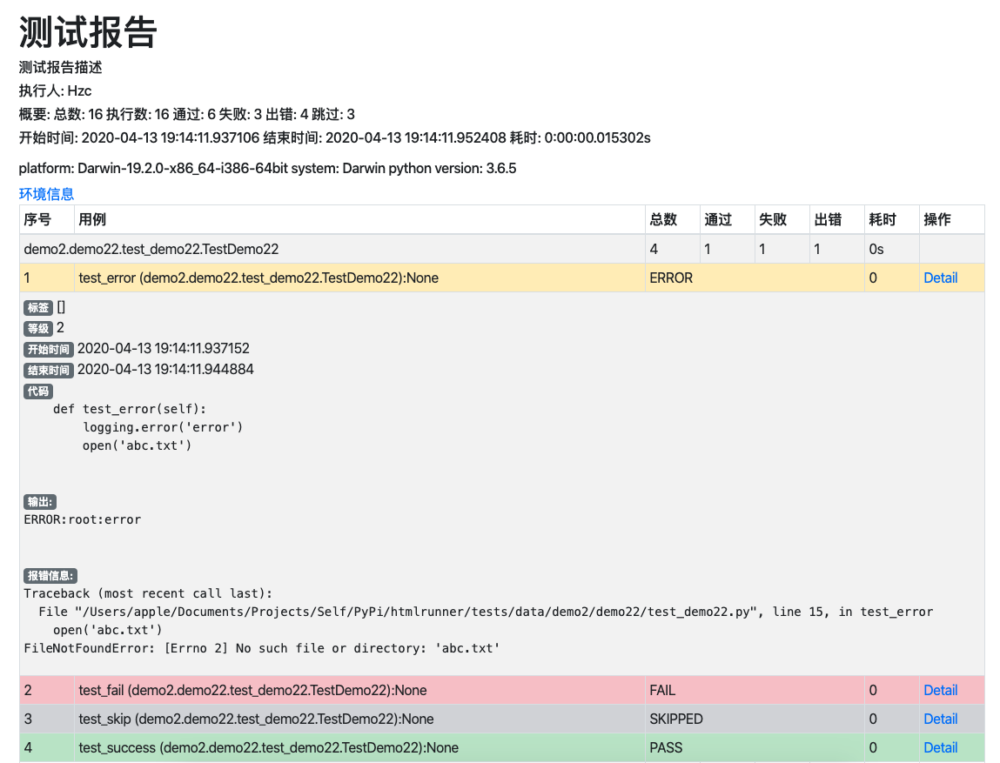

# htmlrunner

HTMLRunner for unittest



## Feature
- 日志
- 添加图片
- [x] 顺序执行/打乱执行
- [x] 多线程
- 失败重试
- [x] 按日期命名
- 多语言
- ~~发送邮件~~
- [x] 按测试类统计
- 统计图
- [x] 执行时间
- [x] 超时时间设置
- [x] 环境信息
- 多次运行结果
- 性能分析
- 不稳定用例
- 标记bug
- 增加稳定性
- 异常解释
- [x] extra信息
- [x] 自定义模板
- email支持格式
- ~~发送到飞书、钉钉、企业微信，短信（仅summary),Confluence~~  (hook)
- [x] 获取代码数据
- [x] tag实现
- [x] level实现
- [x] timeout实现
- [ ] 拦截请求和响应


## Install
```
pip install htmlrunner
```

## Simple Use
```python
from htmlrunner import HTMLRunner
suite = unittest.defaultTestLoader.discover('.')
HTMLRunner(output="report_%Y%m%d_%H%M%S.html",
            title="测试报告",
            description="测试报告描述", tester='Hzc').run(suite)

```


## Todo
- [ ] setup module timeout问题
- [x] not run test duration问题